# gan_sim_super_resolution
Super resolution image generation from 15 combination of low resolution microscopic images

## Sample inputs

  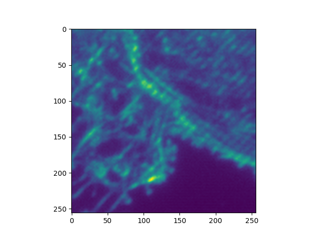
  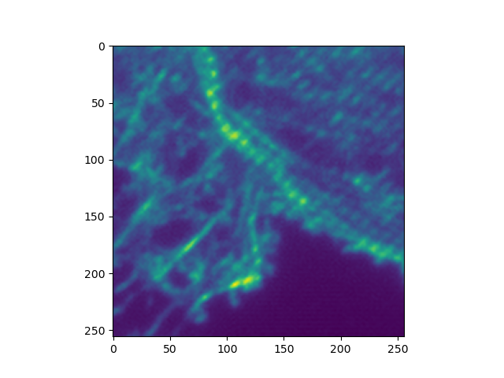
  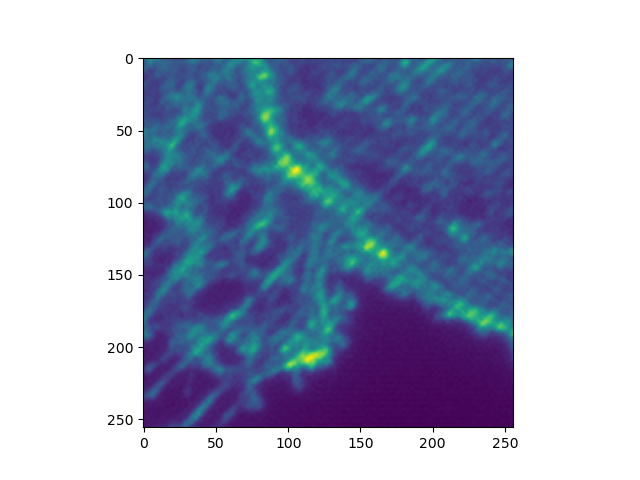 
  
   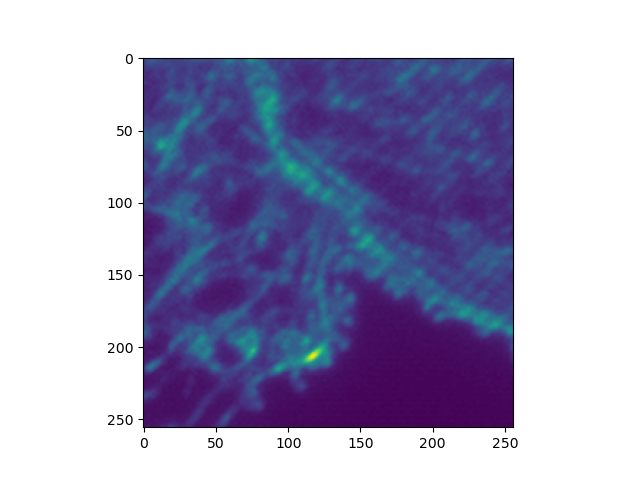

  
  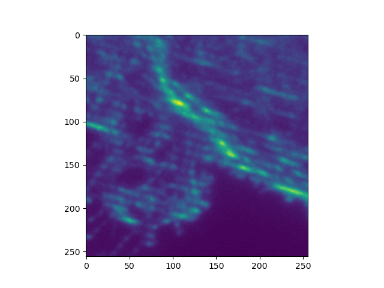
   
  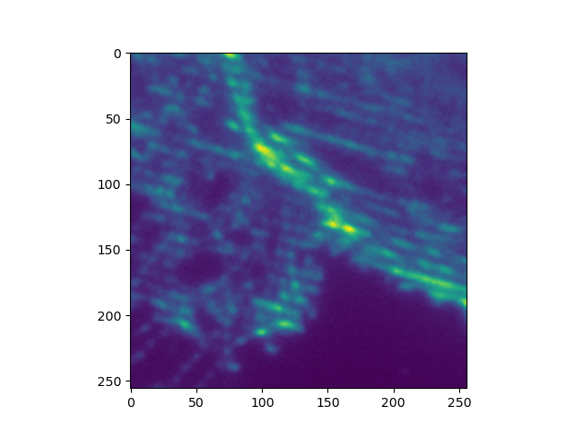
   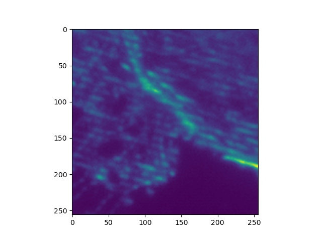

  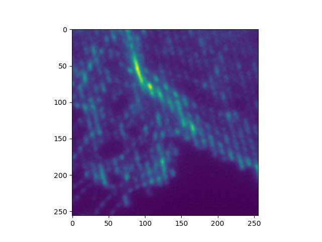
  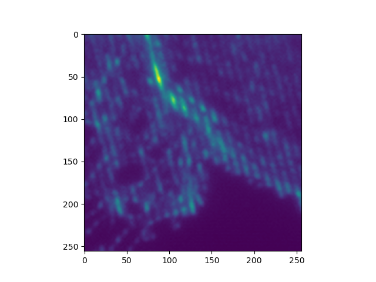
  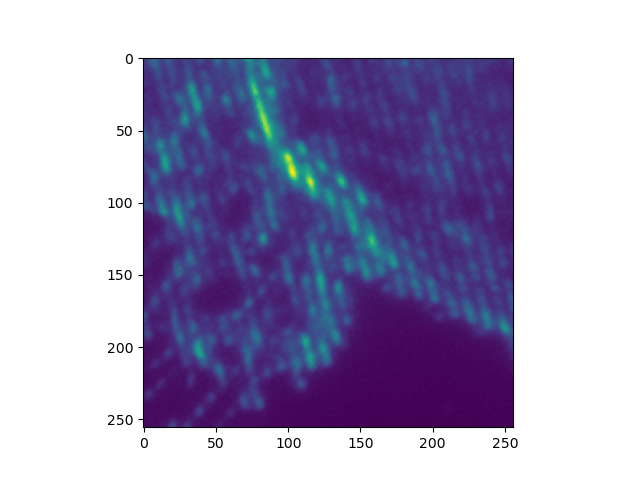 
  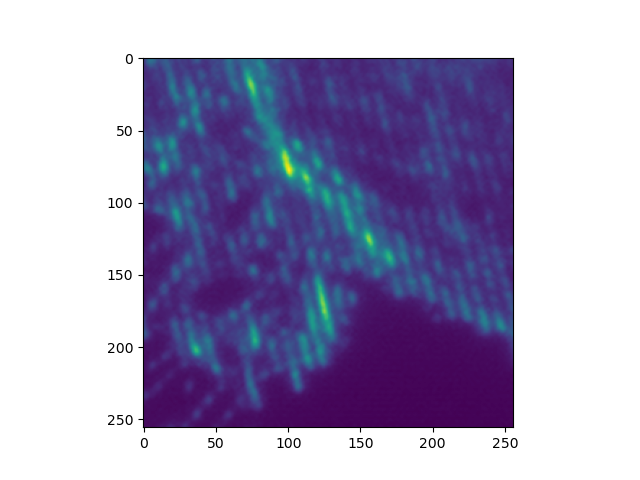
   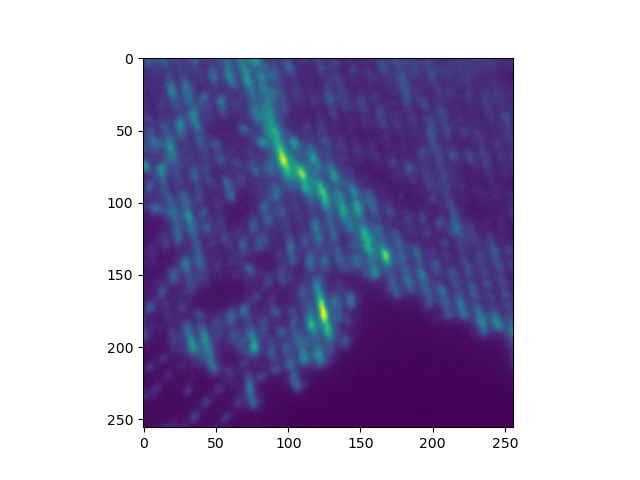

## Sample ground truth image

  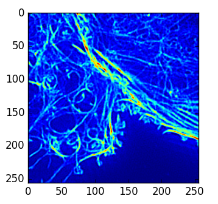

## Predicted SR images over epochs

  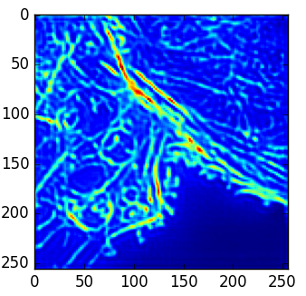
  
  

